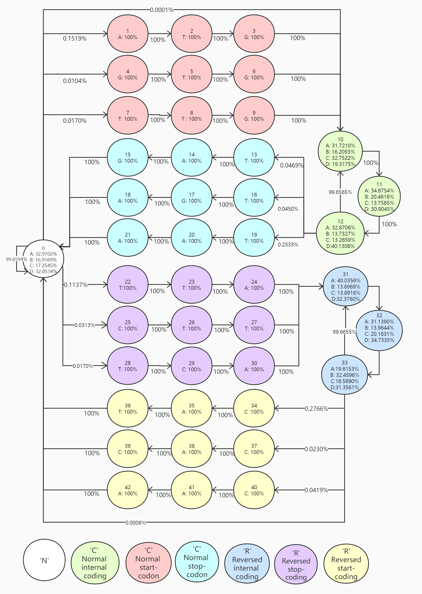

# Hidden_Markov_Model_GeneFinding

This project is about using a hidden Markov model for gene finding (predicting annotations for genomes) in prokaryotes, using a Hidden Markov Model containing 43 hidden states.

The dataset containing 10 Staphylococcus genomes, each containing several genes (i.e. substring) obeying the "gene syntax". The genomes are between 1.8 million and 2.8 million nucleotides long.

The model trained using training by counting and employed a 5-fold cross validation to select the best model. Viterbi decoding to predict 5 unannotated genomes.

### The model:

